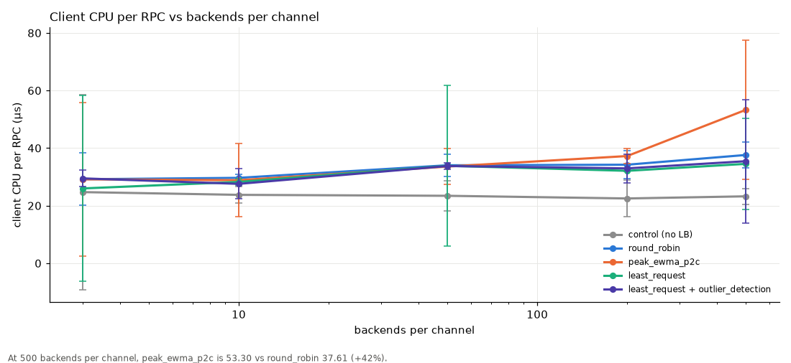
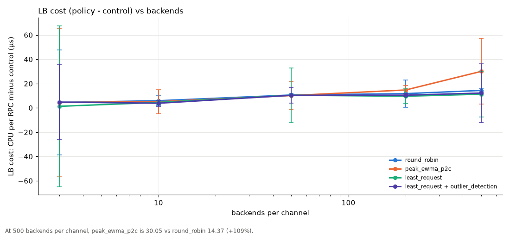
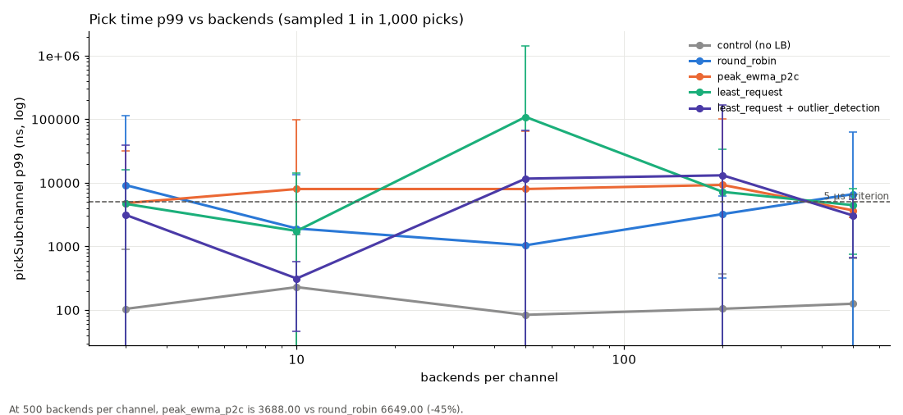
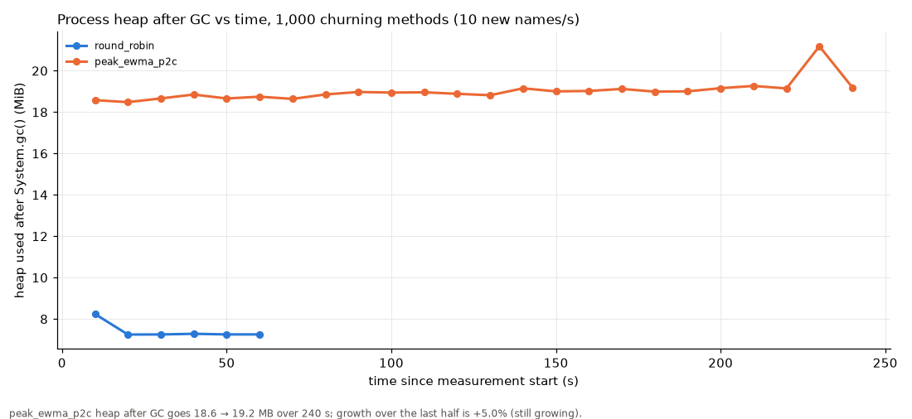
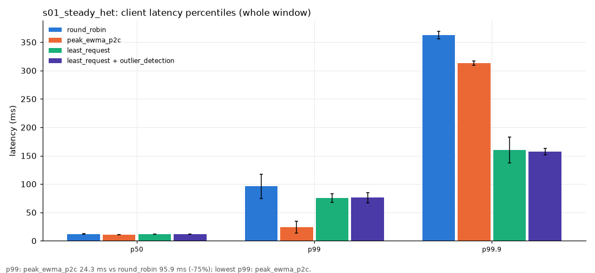
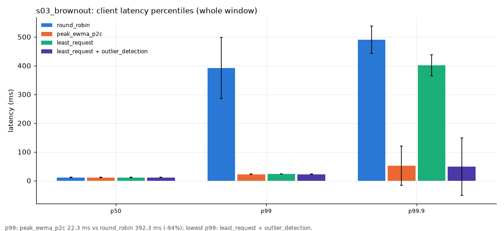
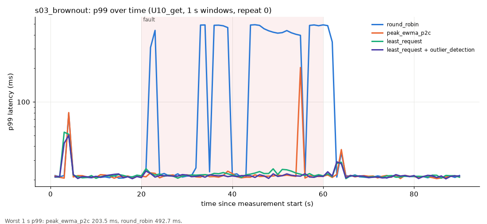
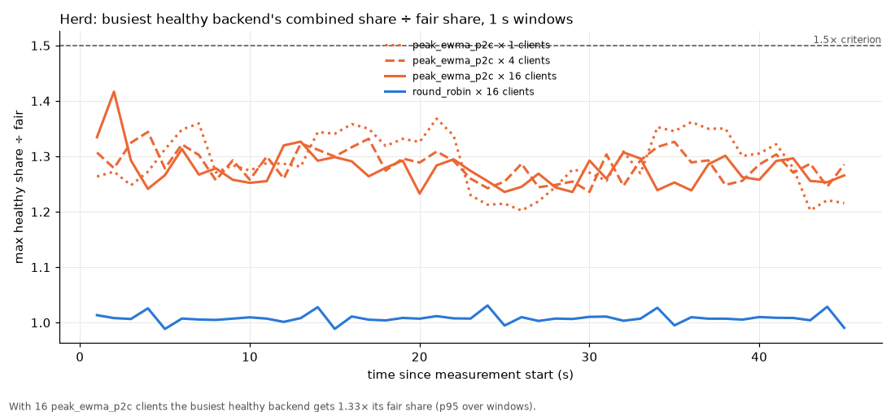
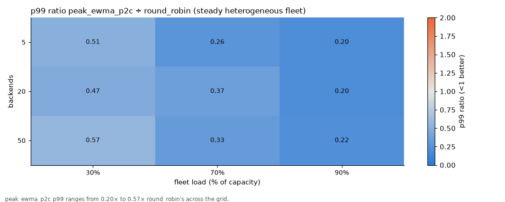

# peak_ewma_p2c load test (#94): cluster-2026-10-04

Commit `5eb6195` (dirty) · openjdk version "25.0.3" 2026-04-21 LTS · gRPC 1.78.0 · Darwin 25.3.0 arm64, 18 CPUs, 64.0 GB · local multi-process (one JVM per pod, loopback TCP, file:/// re-resolution)

Generated from the raw run data with `report.py`. PDF brief: [`report/report.pdf`](report/report.pdf) · tables: [`report/data/`](report/data/) · full interactive report: `report/report.html` (local only: regenerate it with `report.py`).

## Decision table

Worst-case p99 (the fault window, when there is one) and client error rate, mean of repeats. Of 13 scenarios: peak_ewma_p2c wins 1, ties 5, loses 3, mixed 4 (winner named only for material margins: p99 >= 20% and >= 2 ms, errors >= 0.1 pp and 1.5x, recovery >= 5 s).

| scenario | what happens | p99 peak (ms) | p99 least_request (ms) | p99 lr+od (ms) | p99 round_robin (ms) | errors peak | errors least_request | errors lr+od | errors round_robin | verdict (peak vs least_request / lr+od) |
|---|---|---|---|---|---|---|---|---|---|---|
| s01_steady_het | steady, uneven fleet (3 noisy, 1 GC, 1 flaky 5%, 1 throttled of 20) | 24.3 | 75.4 | 76.3 | 95.9 | 0.25% | 0.30% | 0.04% | 0.26% | **peak**: p99 68% lower than least_request; **lr+od**: fewer errors (0.04% vs 0.25%) |
| s02_steady_homo | steady, identical pods | 21.6 | 21.5 | 21.6 | 21.5 | 0.00% | 0.00% | 0.00% | 0.00% | tie |
| s03_brownout | one pod 5x slower for 40 s | 23.0 | 25.1 | 22.8 | 451 | 0.32% | 0.20% | 0.10% | 2.10% | **lr+od**: fewer errors (0.10% vs 0.32%); **lr+od**: recovers faster (4 s vs not within 30 s) |
| s04_crashloop | one pod fails every call for 40 s | 21.6 | 21.6 | 21.6 | 21.4 | 0.08% | 7.62% | 1.76% | 4.87% | **peak**: fewer errors (0.08% vs 1.76%); **least_request**: recovers faster (3 s vs 20 s) |
| s05_blackhole | one pod never answers for 40 s | 23.1 | 23.1 | 23.0 | 23.0 | 0.44% | 0.47% | 0.12% | 4.81% | **lr+od**: fewer errors (0.12% vs 0.44%); **least_request**: recovers faster (3 s vs not within 30 s) |
| s06_gc_pause | one pod pauses 500 ms every 10 s | 23.5 | 22.8 | 22.8 | 24.1 | 0.01% | 0.01% | 0.00% | 0.01% | **least_request**: recovers faster (2 s vs 10 s) |
| s07_rolling_restart | every pod replaced by a cold one | 22.5 | 22.4 | 22.6 | 22.4 | 0.00% | 0.00% | 0.00% | 0.00% | tie |
| s08_scale_up_down | +5 cold pods, then -5 pods | 22.2 | 22.3 | 22.3 | 22.4 | 0.00% | 0.00% | 0.00% | 0.00% | tie |
| s09_max_connection_age | GOAWAY every 10 s | 22.1 | 22.1 | 22.0 | 21.9 | 0.00% | 0.00% | 0.00% | 0.00% | tie |
| s10_node_cpu_contention | 4 pods (one node) 2x slower, half capacity | 24.1 | 345 | 324 | 492 | 0.71% | 0.65% | 0.65% | 3.15% | **peak**: p99 93% lower than lr+od; **least_request**: recovers faster (3 s vs not within 30 s) |
| s11_client_restart | client starts cold against the uneven fleet | 26.2 | 78.2 | 78.6 | 97.4 | 0.25% | 0.29% | 0.08% | 0.27% | **peak**: p99 67% lower than least_request; **lr+od**: fewer errors (0.08% vs 0.25%) |
| s12_cross_zone | a third of the pods +2 ms RTT | 22.9 | 22.9 | 23.0 | 22.9 | 0.00% | 0.00% | 0.00% | 0.00% | tie |
| s13_steady_het_5_methods | uneven fleet, 5 methods 1 ms..1 s | 1,030 | 1,037 | 1,065 | 1,053 | 0.66% | 1.68% | 1.51% | 3.97% | **peak**: fewer errors (0.66% vs 1.51%) |

## Headline numbers

- CPU per RPC at the centre point: peak_ewma_p2c 28.84 µs vs round_robin 29.66 µs (-2.7%); LB cost above the no-LB control: 5.09 µs vs 5.90 µs.
- Allocation: 208 B/RPC more than round_robin (+0.6%).
- Brownout p99 during the fault: 23.0 ms vs round_robin 451.4 ms (ratio 0.05×).
- Steady heterogeneous p99: 24.3 ms vs round_robin 95.9 ms (ratio 0.25×).
- Crash-loop error rate during the fault: 0.08% vs round_robin 4.87%.
- Black hole error rate during the fault: 0.44% vs round_robin 4.81%.

## Go / no-go

| area | criterion | measured | result | note |
|---|---|---|---|---|
| CPU overhead | client CPU/RPC ≤ +25% vs round_robin (10 backends) | 28.84 vs 29.66 µs/RPC (-2.7%, n.s.); LB cost (− control) 5.09 vs 5.90 µs | ✅ PASS | whole-process CPU incl. Netty + harness; LB cost = policy − control |
| CPU overhead | client CPU/RPC ≤ +25% vs round_robin (50 backends) | 33.58 vs 34.03 µs/RPC (-1.3%, n.s.); LB cost (− control) 10.15 vs 10.60 µs | ✅ PASS | whole-process CPU incl. Netty + harness; LB cost = policy − control |
| Allocation | bytes/RPC ≤ +10% vs round_robin (10 backends) | 32,527 vs 32,319 B/RPC (+0.6%; Δ 208 B) | ✅ PASS | harness floor ≈ control's B/RPC dilutes the %; the absolute Δ is the LB's |
| Memory | LB heap plateaus under 1,000 churning methods | growth over last half of 240 s: +5.0% (18.6 → 19.2 MiB) | ❌ FAIL | run is shorter than the 1 h in the issue |
| Pick time | p99 pick < 5 µs at 500 backends | 3,688 ns (sampled 1/1000) | ✅ PASS | wall time of pickSubchannel incl. the timer itself |
| Steady heterogeneous | p99 better than round_robin; error rate ≤ round_robin | p99 24.3 vs 95.9 ms; errors 0.250% vs 0.264% | ✅ PASS |  |
| Brownout | detected within 10 s; p99 during brownout ≤ ½ round_robin's | detect 3.0 s; p99 during 23.0 vs 451.4 ms (0.05×) | ✅ PASS | p99 is of successful calls; errors during the fault 0.32% vs 2.10% (round_robin's slowest calls hit the deadline and count as errors) |
| Crash-loop | client error rate ≤ 20% of round_robin's (fault window) | 0.081% vs 4.874% (0.02×) | ✅ PASS |  |
| Black hole | client error rate ≤ 20% of round_robin's (fault window) | 0.439% vs 4.813% (0.09×) | ✅ PASS |  |
| Homogeneous steady | 0 false ejections/hour; every share within ±10% of fair | 0 ejections in 6.0 client-minutes (0/client-hour); shares 0.983–1.026× fair | ✅ PASS |  |
| Herd (16 clients) | max healthy-backend share ≤ 1.5× fair | 1.33× (p95 of 1 s windows; max 1.42×) | ✅ PASS |  |
| vs least_request + outlier_detection | document where each wins | s01: p99 peak (24.3/76.3 ms), errors lr_od; s02: p99 lr_od (21.6/21.6 ms), errors peak; s03: p99 lr_od (22.3/22.2 ms), errors lr_od; s04: p99 peak (22.3/22.4 ms), errors peak; s05: p99 lr_od (22.4/22.3 ms), errors lr_od; s06: p99 lr_od (22.6/22.4 ms), errors lr_od; s07: p99 peak (22.4/22.5 ms), errors lr_od; s08: p99 peak (22.5/22.5 ms), errors peak; s09: p99 lr_od (22.1/22.0 ms), errors lr_od; s10: p99 peak (23.0/26.6 ms), errors lr_od; s11: p99 peak (26.2/78.6 ms), errors lr_od; s12: p99 peak (22.9/23.0 ms), errors peak; s13: p99 peak (1,030/1,065 ms), errors peak | ℹ️ INFO |  |

## Key charts

### Client CPU per RPC vs backends per channel

_At 500 backends per channel, peak_ewma_p2c is 53.30 vs round_robin 37.61 (+42%)._

### LB cost (policy - control) vs backends

_At 500 backends per channel, peak_ewma_p2c is 30.05 vs round_robin 14.37 (+109%)._

### Pick time p99 vs backends (sampled 1 in 1,000 picks)

_At 500 backends per channel, peak_ewma_p2c is 3688.00 vs round_robin 6649.00 (-45%)._

### Process heap after GC vs time, 1,000 churning methods (10 new names/s)

_peak_ewma_p2c heap after GC goes 18.6 → 19.2 MB over 240 s; growth over the last half is +5.0% (still growing)._

### s01_steady_het: client latency percentiles (whole window)

_p99: peak_ewma_p2c 24.3 ms vs round_robin 95.9 ms (-75%); lowest p99: peak_ewma_p2c._

### s03_brownout: client latency percentiles (whole window)

_p99: peak_ewma_p2c 22.3 ms vs round_robin 392.3 ms (-94%); lowest p99: least_request + outlier_detection._

### s03_brownout: p99 over time (U10_get, 1 s windows, repeat 0)

_Worst 1 s p99: peak_ewma_p2c 203.5 ms, round_robin 492.7 ms._

### Herd: busiest healthy backend's combined share ÷ fair share, 1 s windows

_With 16 peak_ewma_p2c clients the busiest healthy backend gets 1.33× its fair share (p95 over windows)._

### p99 ratio peak_ewma_p2c ÷ round_robin (steady heterogeneous fleet)

_peak_ewma_p2c p99 ranges from 0.20× to 0.57× round_robin's across the grid._

## Repeats

Tier 1: 18 cells, 2–2 repeats per cell × policy (180 runs). Tier 2: 13 scenarios, 2–2 repeats each; 9 sensitivity cells and 4 herd cells (1 repeat each).

## Caveats

- Local multi-process run on one 18-core Mac, not a real cluster: one JVM per backend pod and per client pod, real gRPC over loopback TCP, pod churn via a re-read address file instead of DNS. No real network RTT, no node boundaries; all pods share the same CPUs.
- Backends model capacity with a fixed number of concurrent slots (8) and a FIFO queue, and lognormal service times; faults (latency factor, UNAVAILABLE, black hole, stop-the-world pauses, +RTT) are injected through the admin endpoint.
- All policies share the fleet concurrently, so one policy's routing changes the load the others see (e.g. round_robin keeps loading a slow pod, which makes it slower for everyone).
- Fault scenarios use a homogeneous base fleet so the fault is the only difference; s01, s11 and s13 use the heterogeneous fleet (14 normal, 3 noisy, 1 GC-pausing, 1 flaky, 1 CPU-throttled at 20 pods).
- Time-compressed: brownout lasts 40 s instead of 2 min, scenario windows are 90 s instead of 5–10 min, sensitivity/herd cells 45 s with one repeat, and the memory-churn run is minutes, not 1 h.
- Tier 1 CPU and allocation are whole-process figures that include Netty and the loadgen; the harness floor (control) is large, so percentage deltas are diluted and the policy − control figures are the LB's own cost.
- lr_od = grpc outlier_detection_experimental (interval 10 s, base ejection 30 s, max 20% ejected, success-rate and failure-percentage ejection) wrapping least_request_experimental (choiceCount 2).
- Latency percentiles are of successful calls; failed calls (including deadline exceeded) are counted in the error rate. Per repeat, a policy's percentile is the mean of its clients' percentiles (not a merged histogram).
