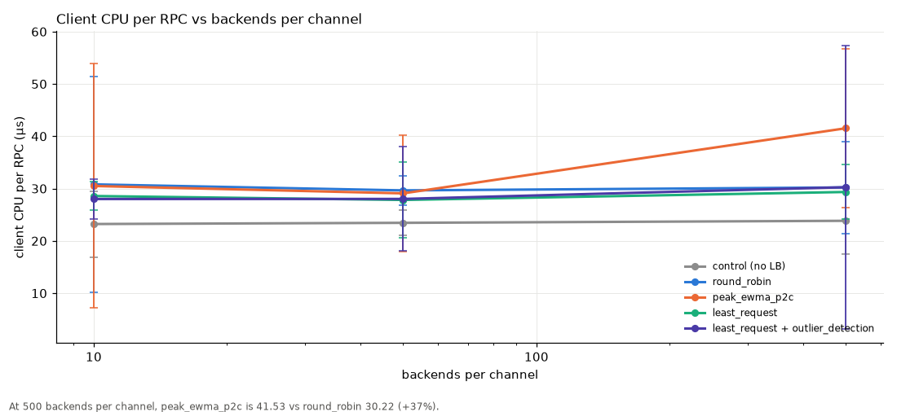
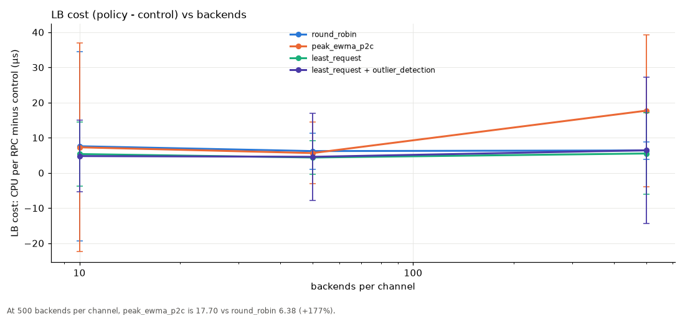
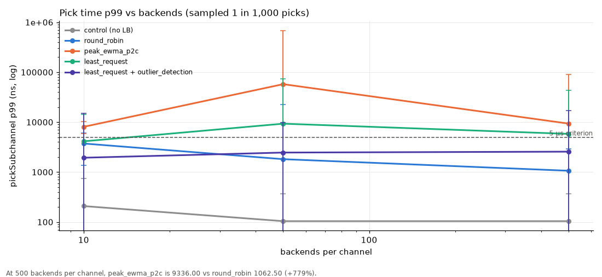
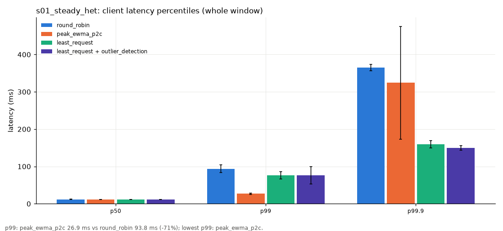
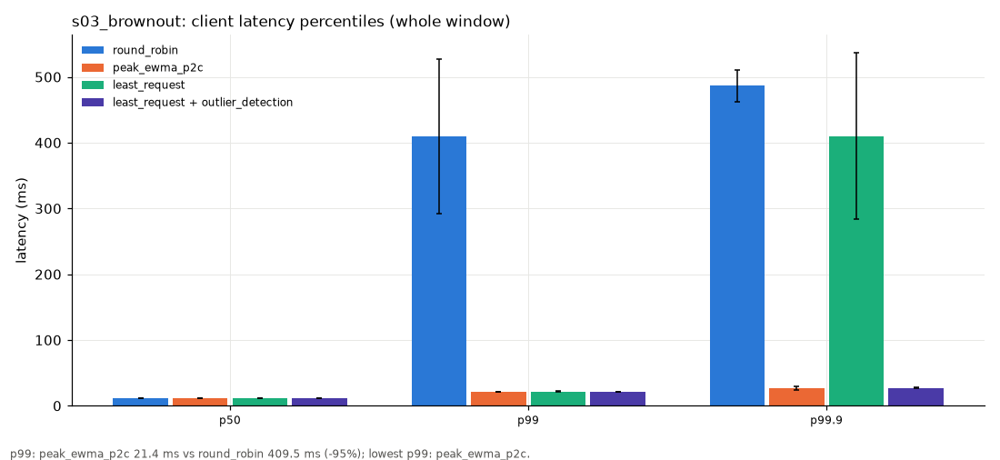
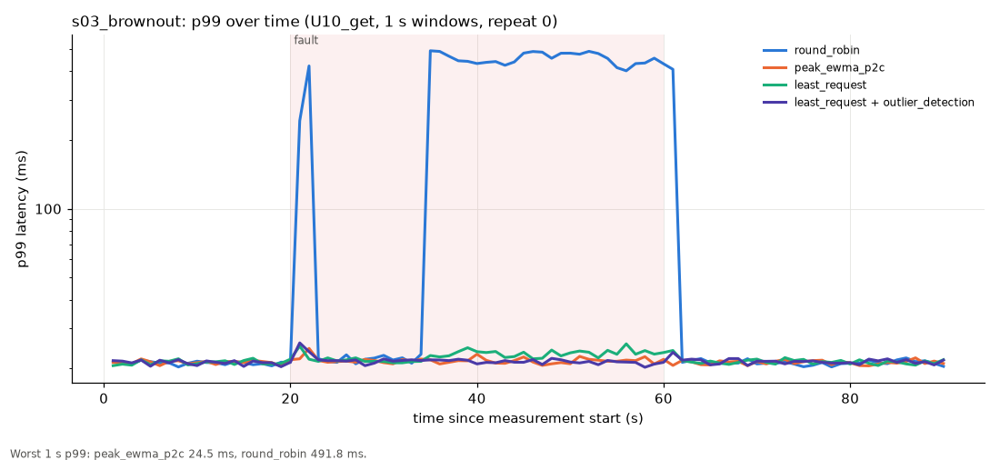

# peak_ewma_p2c load test (#94): cluster-2026-10-05-fixes

Commit `1eb5caf` (dirty) · openjdk version "25.0.3" 2026-04-21 LTS · gRPC 1.78.0 · Darwin 25.3.0 arm64, 18 CPUs, 64.0 GB · local multi-process (one JVM per pod, loopback TCP, file:/// re-resolution)

Generated from the raw run data with `report.py` (full interactive report: `report/report.html`, PDF brief: `report/report.pdf`; neither is committed). Tables: [`report/data/`](report/data/).

## Decision table

Worst-case p99 (the fault window, when there is one) and client error rate, mean of repeats. Of 7 scenarios: peak_ewma_p2c wins 2, ties 2, loses 1, mixed 2 (winner named only for material margins: p99 >= 20% and >= 2 ms, errors >= 0.1 pp and 1.5x, recovery >= 5 s).

| scenario | what happens | p99 peak (ms) | p99 least_request (ms) | p99 lr+od (ms) | p99 round_robin (ms) | errors peak | errors least_request | errors lr+od | errors round_robin | verdict (peak vs least_request / lr+od) |
|---|---|---|---|---|---|---|---|---|---|---|
| s01_steady_het | steady, uneven fleet (3 noisy, 1 GC, 1 flaky 5%, 1 throttled of 20) | 26.9 | 76.1 | 76.0 | 93.8 | 0.03% | 0.29% | 0.07% | 0.27% | **peak**: p99 65% lower than lr+od |
| s02_steady_homo | steady, identical pods | 21.3 | 21.4 | 21.3 | 21.3 | 0.00% | 0.00% | 0.00% | 0.00% | tie |
| s03_brownout | one pod 5x slower for 40 s | 21.5 | 22.6 | 21.5 | 450 | 0.03% | 0.15% | 0.10% | 1.50% | **least_request**: recovers faster (4 s vs 13 s) |
| s04_crashloop | one pod fails every call for 40 s | 21.5 | 21.4 | 21.3 | 21.3 | 0.05% | 7.59% | 1.87% | 4.87% | **peak**: fewer errors (0.05% vs 1.87%); **least_request**: recovers faster (3 s vs 17 s) |
| s05_blackhole | one pod never answers for 40 s | 21.5 | 21.5 | 21.4 | 21.3 | 0.09% | 0.47% | 0.12% | 4.81% | tie |
| s10_node_cpu_contention | 4 pods (one node) 2x slower, half capacity | 23.6 | 333 | 314 | 488 | 0.14% | 0.52% | 0.47% | 2.36% | **peak**: p99 92% lower than lr+od; **peak**: fewer errors (0.14% vs 0.47%); **least_request**: recovers faster (3 s vs 21 s) |
| s11_client_restart | client starts cold against the uneven fleet | 30.3 | 76.5 | 77.2 | 97.8 | 0.04% | 0.30% | 0.09% | 0.27% | **peak**: p99 60% lower than least_request |

## Headline numbers

- CPU per RPC at the centre point: peak_ewma_p2c 30.50 µs vs round_robin 30.81 µs (-1.0%); LB cost above the no-LB control: 7.27 µs vs 7.58 µs.
- Allocation: 249 B/RPC more than round_robin (+0.8%).
- Brownout p99 during the fault: 21.5 ms vs round_robin 450.0 ms (ratio 0.05×).
- Steady heterogeneous p99: 26.9 ms vs round_robin 93.8 ms (ratio 0.29×).
- Crash-loop error rate during the fault: 0.05% vs round_robin 4.87%.
- Black hole error rate during the fault: 0.09% vs round_robin 4.81%.

## Go / no-go

| area | criterion | measured | result | note |
|---|---|---|---|---|
| CPU overhead | client CPU/RPC ≤ +25% vs round_robin (10 backends) | 30.50 vs 30.81 µs/RPC (-1.0%, n.s.); LB cost (− control) 7.27 vs 7.58 µs | ✅ PASS | whole-process CPU incl. Netty + harness; LB cost = policy − control |
| CPU overhead | client CPU/RPC ≤ +25% vs round_robin (50 backends) | 29.09 vs 29.65 µs/RPC (-1.9%, n.s.); LB cost (− control) 5.63 vs 6.20 µs | ✅ PASS | whole-process CPU incl. Netty + harness; LB cost = policy − control |
| Allocation | bytes/RPC ≤ +10% vs round_robin (10 backends) | 32,507 vs 32,258 B/RPC (+0.8%; Δ 249 B) | ✅ PASS | harness floor ≈ control's B/RPC dilutes the %; the absolute Δ is the LB's |
| Memory | LB heap plateaus under 1,000 churning methods | no data | ➖ N/A |  |
| Pick time | p99 pick < 5 µs at 500 backends | 9,336 ns (sampled 1/1000) | ❌ FAIL | wall time of pickSubchannel incl. the timer itself |
| Steady heterogeneous | p99 better than round_robin; error rate ≤ round_robin | p99 26.9 vs 93.8 ms; errors 0.027% vs 0.267% | ✅ PASS |  |
| Brownout | detected within 10 s; p99 during brownout ≤ ½ round_robin's | detect 3.0 s; p99 during 21.5 vs 450.0 ms (0.05×) | ✅ PASS | p99 is of successful calls; errors during the fault 0.03% vs 1.50% (round_robin's slowest calls hit the deadline and count as errors) |
| Crash-loop | client error rate ≤ 20% of round_robin's (fault window) | 0.054% vs 4.872% (0.01×) | ✅ PASS |  |
| Black hole | client error rate ≤ 20% of round_robin's (fault window) | 0.092% vs 4.813% (0.02×) | ✅ PASS |  |
| Homogeneous steady | 0 false ejections/hour; every share within ±10% of fair | 0 ejections in 6.0 client-minutes (0/client-hour); shares 0.948–1.013× fair | ✅ PASS |  |
| Herd (16 clients) | max healthy-backend share ≤ 1.5× fair | no data | ➖ N/A |  |
| vs least_request + outlier_detection | document where each wins | s01: p99 peak (26.9/76.0 ms), errors peak; s02: p99 lr_od (21.3/21.3 ms), errors peak; s03: p99 lr_od (21.4/21.4 ms), errors peak; s04: p99 peak (21.4/21.4 ms), errors peak; s05: p99 lr_od (21.4/21.3 ms), errors peak; s10: p99 peak (22.4/26.3 ms), errors peak; s11: p99 peak (30.3/77.2 ms), errors peak | ℹ️ INFO |  |

## Key charts

### Client CPU per RPC vs backends per channel

_At 500 backends per channel, peak_ewma_p2c is 41.53 vs round_robin 30.22 (+37%)._

### LB cost (policy - control) vs backends

_At 500 backends per channel, peak_ewma_p2c is 17.70 vs round_robin 6.38 (+177%)._

### Pick time p99 vs backends (sampled 1 in 1,000 picks)

_At 500 backends per channel, peak_ewma_p2c is 9336.00 vs round_robin 1062.50 (+779%)._

### s01_steady_het: client latency percentiles (whole window)

_p99: peak_ewma_p2c 26.9 ms vs round_robin 93.8 ms (-71%); lowest p99: peak_ewma_p2c._

### s03_brownout: client latency percentiles (whole window)

_p99: peak_ewma_p2c 21.4 ms vs round_robin 409.5 ms (-95%); lowest p99: peak_ewma_p2c._

### s03_brownout: p99 over time (U10_get, 1 s windows, repeat 0)

_Worst 1 s p99: peak_ewma_p2c 24.5 ms, round_robin 491.8 ms._

## Repeats

Tier 1: 4 cells, 2–2 repeats per cell × policy (40 runs). Tier 2: 7 scenarios, 2–2 repeats each; 0 sensitivity cells and 0 herd cells (1 repeat each).

## Caveats

- Local multi-process run on one 18-core Mac, not a real cluster: one JVM per backend pod and per client pod, real gRPC over loopback TCP, pod churn via a re-read address file instead of DNS. No real network RTT, no node boundaries; all pods share the same CPUs.
- Backends model capacity with a fixed number of concurrent slots (8) and a FIFO queue, and lognormal service times; faults (latency factor, UNAVAILABLE, black hole, stop-the-world pauses, +RTT) are injected through the admin endpoint.
- All policies share the fleet concurrently, so one policy's routing changes the load the others see (e.g. round_robin keeps loading a slow pod, which makes it slower for everyone).
- Fault scenarios use a homogeneous base fleet so the fault is the only difference; s01, s11 and s13 use the heterogeneous fleet (14 normal, 3 noisy, 1 GC-pausing, 1 flaky, 1 CPU-throttled at 20 pods).
- Time-compressed: brownout lasts 40 s instead of 2 min, scenario windows are 90 s instead of 5–10 min, sensitivity/herd cells 45 s with one repeat, and the memory-churn run is minutes, not 1 h.
- Tier 1 CPU and allocation are whole-process figures that include Netty and the loadgen; the harness floor (control) is large, so percentage deltas are diluted and the policy − control figures are the LB's own cost.
- lr_od = grpc outlier_detection_experimental (interval 10 s, base ejection 30 s, max 20% ejected, success-rate and failure-percentage ejection) wrapping least_request_experimental (choiceCount 2).
- Latency percentiles are of successful calls; failed calls (including deadline exceeded) are counted in the error rate. Per repeat, a policy's percentile is the mean of its clients' percentiles (not a merged histogram).
